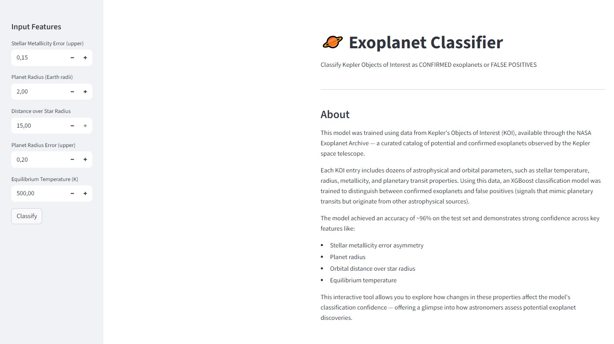

# 🪐 Exoplanet Classifier

Classification of Kepler Objects of Interest (KOI) as confirmed exoplanets or false positives using machine learning.

## Results

| Model | Accuracy | Precision | Recall | F1 | ROC-AUC |
|-------|----------|-----------|--------|-----|---------|
| Logistic Regression | 87.8% | 84.8% | 93.9% | 89.1% | 0.927 |
| Random Forest | 94.9% | 96.4% | 93.9% | 95.1% | 0.986 |
| **XGBoost** | **96.1%** | **95.6%** | **97.3%** | **96.4%** | **0.991** |

## Demo




## Dataset

NASA Exoplanet Archive - Kepler KOI Cumulative Table
- Original samples: 9,564 KOIs
- After preprocessing: 4,788 samples (CONFIRMED + FALSE POSITIVE)
- Features: 74 astrophysical parameters

## Installation
```bash
git clone https://github.com/TheCoolerMendeiros/exoplanet-classifier
cd exoplanet-classifier
pip install -r requirements.txt
```
##  Usage

### Run Streamlit App

```bash
streamlit run app.py
```

### Jupyter Notebook

Open notebooks/exoplanet_analysis.ipynb for full analysis and model training.

## License

MIT

## References

-[NASA Exoplatet Archive](https://exoplanetarchive.ipas.caltech.edu/)

-[Kepler Mission](https://www.nasa.gov/mission_pages/kepler/main/index.html)